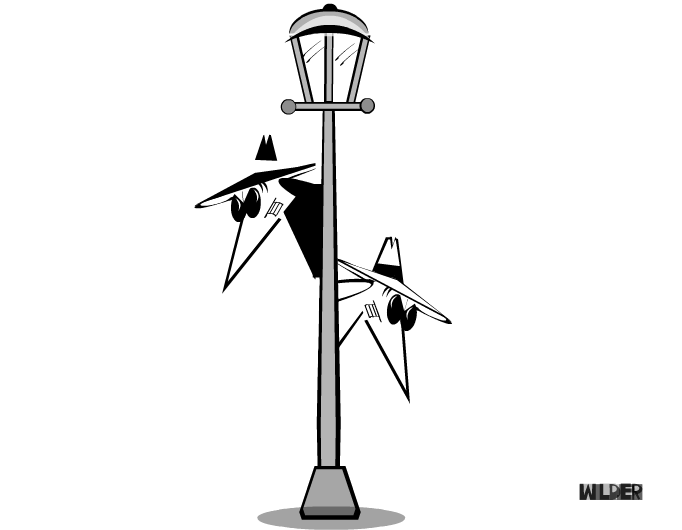
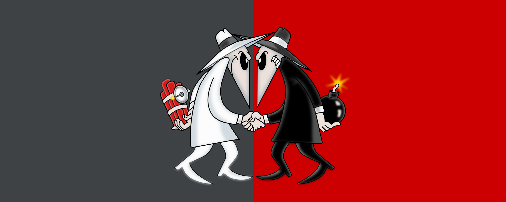
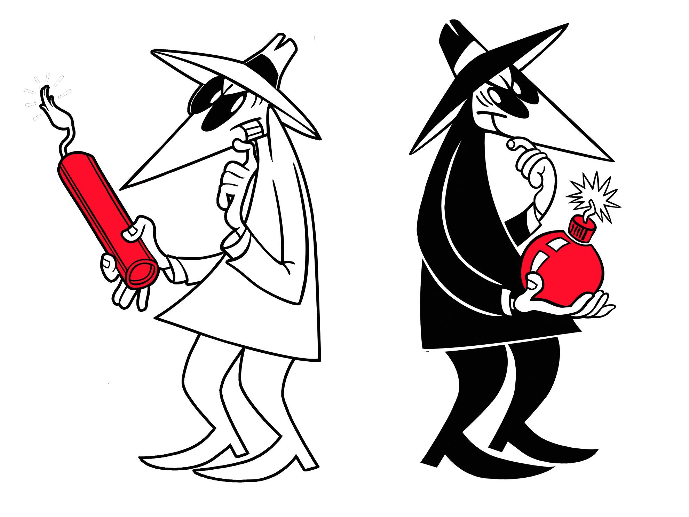
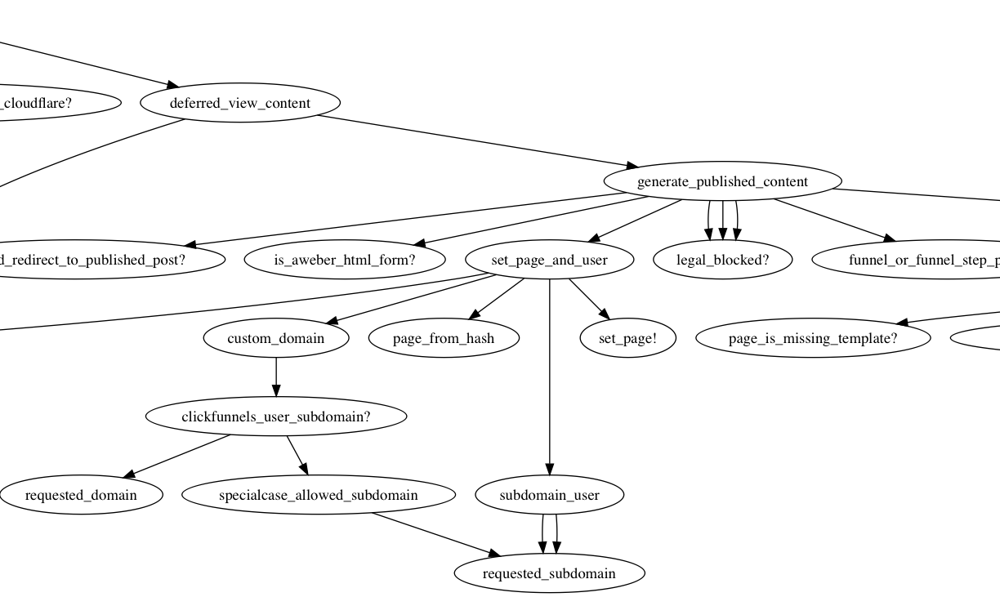
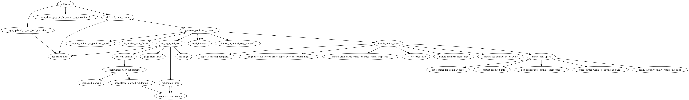

build-lists: true
autoscale: true
footer: *@jagthedrummer*
slidenumbers: false



#[fit] Spy on Ruby
# with
#[fit] Tracepoint


---

## What is Tracepoint?

* Part of ruby-core

* Allows you to listen for different types of code execution events

* Similar to `Kernel#set_trace_func`

---

## Example Usage

### Listening for any raised exception


---

### Listening for any raised exception

```ruby
trace = TracePoint.new(:raise) do |tp|
    p [tp.lineno, tp.event, tp.raised_exception]
end
#=> #<TracePoint:0x007f786a452448>
```

---

### Listening for any raised exception

```ruby
trace = TracePoint.new(:raise) do |tp|
    p [tp.lineno, tp.event, tp.raised_exception]
end

trace.enable
#=> #<TracePoint:0x007f786a452448>

```

---

### Listening for any raised exception

```ruby
trace = TracePoint.new(:raise) do |tp|
    p [tp.lineno, tp.event, tp.raised_exception]
end

trace.enable

0 / 0
#=> [5, :raise, #<ZeroDivisionError: divided by 0>]


```

---

### Listening for any raised exception

```ruby
trace = TracePoint.new(:raise) do |tp|
    p [tp.lineno, tp.event, tp.raised_exception]
end

trace.enable

0 / 0

trace.disable
```

---

##[fit] Why is this useful?
` `
` `
` `
` `
` `
` `
` `




---

## Why is this useful?

```ruby
def report_data_to_flaky_reports_r_us(data)
  uri = URI('http://www.flaky-reports-r-us.com/')
  res = Net::HTTP.post_form(uri, data)
  return res.body
rescue
  # lol we failed, who cares?
end
```

---

```ruby
around_action :trace_exceptions

def trace_exceptions
  trace = TracePoint.new(:raise) do |tp|
    logger.error [tp.lineno, tp.event, tp.raised_exception]
  end

  trace.enable
  yield
  trace.disable
end
```

---

## Types of events



---

## Types of events

:raise - raise an exception

:line - execute code on a new line

:class - start a class or module definition

:end - finish a class or module definition

:call - call a Ruby method

:return - return from a Ruby method

---

## Types of events

:c_call - call a C-language routine

:c_return - return from a C-language routine


:b_call - event hook at block entry

:b_return - event hook at block ending

:thread_begin - event hook at thread beginning

:thread_end - event hook at thread ending

---

## Real World Example


---

## Refactoring a complex controller

* 1 Controller

* 91 actions/methods

* 1628 lines

---



---



---

```ruby
    around_action :graph_method_calls
    def graph_method_calls
      g = GraphViz.new( :G, :type => :digraph )
      nodes = []
      trace = TracePoint.new(:call,:return) do |tp|
        if tp.path =~ /app\/controllers/
          method_name = "#{tp.defined_class}##{tp.method_id}"
          if tp.event == :call
            new_node = g.add_nodes(method_name)
            old_node = nodes.last
            if new_node.present? && old_node.present?
              g.add_edges(old_node[:node], new_node)
            end
            nodes << { method_name: method_name, node: new_node }
          elsif tp.event == :return
            old_node = nodes.last
            prev_node = nodes[-2]
            if old_node[:method_name] == method_name
              nodes.pop
            end
          end
        end
      end
      trace.enable
        yield
      trace.disable
      g.output( :png => "method_call_graph.png" )
    end
```

---

###[fit] https://gist.github.com/jagthedrummer/34184b49277dc2fb379421a8a797ccaf

---

#[fit] Thanks!

Jeremy Green

Consultant, Author, SaaSer


www.octolabs.com

@jagthedrummer

jeremy@octolabs.com


